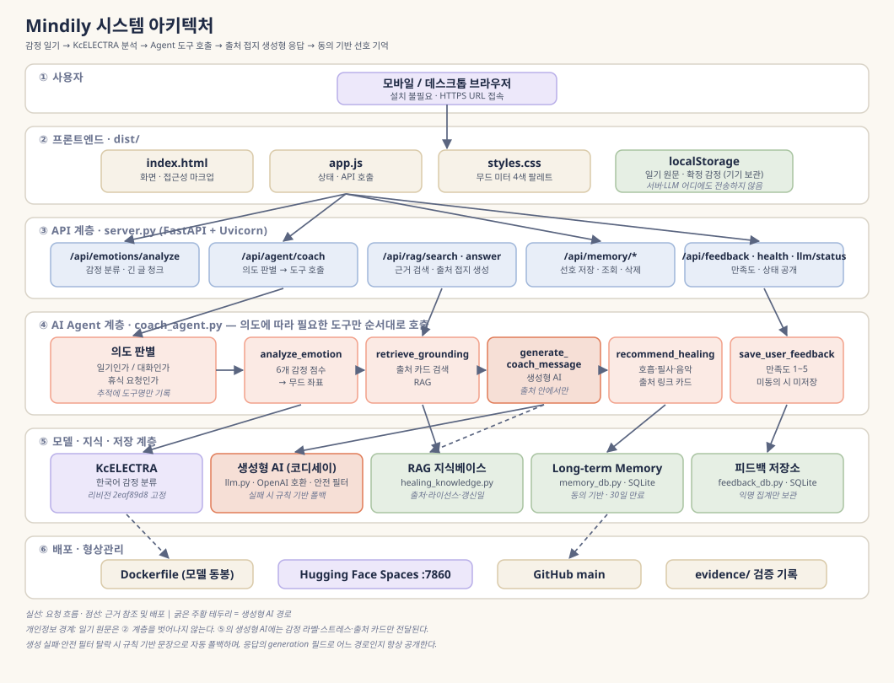
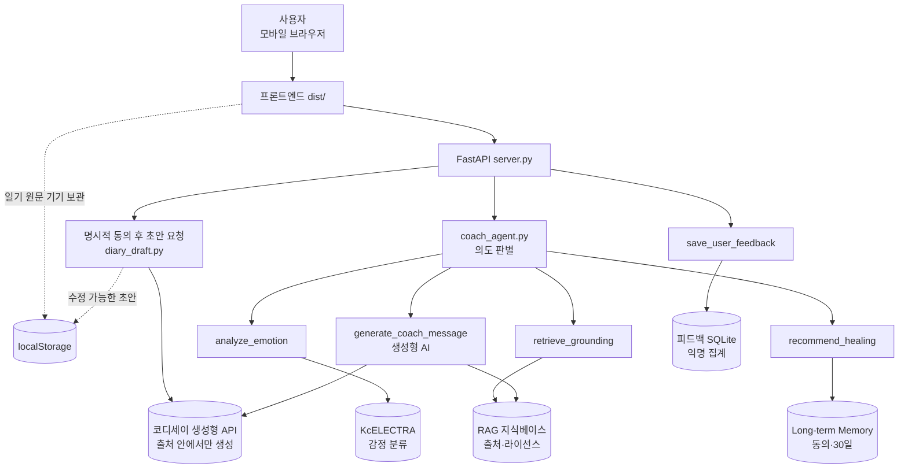

# 시스템 아키텍처



위 그림은 기본 감정 분석·코치 흐름을 보여줍니다. 사용자 문구 수정, 일기 기반 초안, 사건 요약의 추가 흐름은 아래 2.4절과 Mermaid 다이어그램에 반영했습니다.

---

## 1. 계층 구조

| 계층 | 구성 | 책임 |
|---|---|---|
| ① 사용자 | 모바일·데스크톱 브라우저 | 설치 없이 HTTPS URL로 접속. 홈 화면에 추가하면 설치형 웹앱으로 실행 |
| ② 프론트엔드 | `dist/index.html`, `app.js`, `styles.css`, `manifest.webmanifest`, `sw.js`, localStorage | 화면 렌더링, API 호출, **일기 원문 기기 보관**, 수정 가능한 개인 문구·정리 초안·사건 요약 저장, 기록 그래프·보고서 계산, 자연의 소리 합성 |
| ③ API | `server.py` (FastAPI + Uvicorn) | 요청 검증, 라우팅, 상태 공개 |
| ④ Agent | `coach_agent.py` | 의도 판별 후 도구를 순서대로 호출 |
| ⑤ 모델·지식·저장 | KcELECTRA, `llm.py`, `diary_draft.py`, `rag.py`, `healing_knowledge.py`, `memory_db.py`, `feedback_db.py` | 분류 추론, 출처 접지 코칭, 동의 기반 일기 초안·사건 요약 생성, 선호·피드백 저장 |
| ⑥ 배포 | Dockerfile → Hugging Face Spaces, GitHub `main` | 영구 HTTPS URL 제공, 이력 관리 |

---

## 2. 핵심 데이터 흐름

### 2.1 감정 일기 흐름

```
사용자 일기 입력 + 스트레스 1~5
  → POST /api/agent/coach
  → coach_agent: 의도 = "일기"
      ├─ analyze_emotion(text, stress)
      │     → KcELECTRA 추론 → 6개 감정 점수 → 무드 미터 좌표
      ├─ retrieve_grounding(emotion, stress)
      │     → healing_knowledge 검색 → 출처 카드 3장
      ├─ generate_coach_message(emotion, stress, sources)   ← 생성형 AI
      │     → 출처 카드만 컨텍스트로 전달 (일기 원문 미전송)
      │     → 안전 검사 통과 시 채택, 실패 시 규칙 기반 폴백
      └─ recommend_healing(emotion, stress, 선호)
            → 출처 링크가 붙은 추천 카드
  → 응답: 코치 문장 + 출처 + 추천 카드 + generation 경로 + 도구 실행 추적
  → 사용자가 무드 미터에서 최종 감정 확정 (모델 제안과 별도 필드)
  → localStorage에 원문·확정 감정 저장 (분석 요청 때 서버로 전송하되 서버에 저장하지 않음)
```

### 2.2 생성형 AI 경로 상세

```
                     ┌─ 키 미설정  → deterministic_fallback (not_configured)
generate_coach_message ┼─ 호출 실패  → deterministic_fallback (call_failed)
                     ├─ 금지어 검출 → deterministic_fallback (safety_filter)
                     └─ 정상        → llm_grounded
```

어느 경로든 **같은 출처 카드**를 함께 반환하므로, 사용자는 "왜 이 활동을 권했는가"를 언제나 링크로 확인할 수 있습니다.

### 2.3 기억·피드백 흐름

```
[동의 O] 선호 활동 → POST /api/memory → SQLite 저장 (30일 만료)
[동의 X] 저장하지 않음 — 기능은 그대로 사용 가능
종료 설문 만족도 1~5 → save_user_feedback → 익명 집계 SQLite
다음 방문 → POST /api/memory/read → 30일 이내 선호만 추천 가중치에 반영
```

---

### 2.4 사용자가 요청하는 초안·보고서 경로

```text
브라우저의 최신 일기 → 전송 안내 확인·동의 → POST /api/diary/organizer-draft
  → diary_draft.py → 생성형 AI가 있으면 일기 기반 사건·감정 초안
                  → 없거나 실패하면 문장 발췌·분류 감정 기반 임시 초안
  → 사용자가 두 칸을 수정 → 브라우저 localStorage에 저장

선택 기간의 일기 전체 → 별도 동의 → 10건씩 POST /api/report/events
  → 선택 기간의 일기 전체를 10건씩 요청 → 일기별 사건·기록된 감정 목록
  → 사용자가 확인·수정·항목 삭제 → 기간별 브라우저 저장·삭제
  → 보고서 다운로드에는 수정한 요약만 포함 (일기 원문 전체 제외)
```

이 두 API는 사용자가 명시적으로 초안 버튼을 누를 때만 원문을 받습니다. 생성형 AI 설정이 활성화되어 있으면 해당 원문이 외부 코디세이 API로 전송됩니다. 다른 코치 문장 생성 경로에는 기존대로 일기 원문을 보내지 않습니다.

## 3. 설계 결정과 근거

| 결정 | 대안 | 선택 이유 |
|---|---|---|
| 감정 **분류**에 전용 모델 | LLM에게 감정 추정 요청 | 점수·모델 버전을 공개해 **검증 가능**. LLM 추정은 근거 제시 불가 |
| 감정 **표현**에 생성형 AI | 규칙 기반 템플릿만 사용 | 문장의 자연스러움은 생성형이 우위. 단, 출처 밖으로 나가지 못하게 제한 |
| 일반 코치 생성에 **일기 원문 미전송** | 원문 전달로 공감도 향상 | 평소에는 감정 라벨·스트레스·출처 카드만 전송. 사용자가 별도 동의한 초안 요청에만 원문 전송 |
| 생성 실패 시 **자동 폴백** | 오류 표시 | 외부 API 장애가 서비스 중단이 되지 않게. 경로는 항상 공개 |
| 일기 원문 **브라우저 보관** | 서버 DB 저장 | 개인정보 최소 수집 |
| 선호 기억 **30일 만료** | 무기한 보관 | 개인화와 보호를 동시에 증명 |
| 기록 그래프·보고서를 **기기 안에서 계산** | 서버에서 집계 | 일기와 기록을 서버로 보내지 않는다는 원칙을 그대로 지킨다 |
| 자연의 소리를 **브라우저에서 합성** | 음원 파일 동봉 | 저작권 문제와 이미지 용량 증가를 동시에 없앤다 (Web Audio API) |
| **설치형 웹앱(PWA)** | 네이티브 앱 등록 | 등록비·심사 없이 홈 화면 설치. 화면 자원만 캐시하고 `/api/*`는 캐시하지 않는다 |
| **Hugging Face Spaces** 배포 | Render 유료 플랜 | 무료 등급으로 영구 HTTPS URL, 모델을 이미지에 동봉해 콜드스타트 제거 |

---

## 4. 개인정보 경계

일기 원문은 분석·초안 요청 때 API 계층으로 전송되지만 서버 DB에 저장하지 않습니다. 일반 코치 생성형 AI에는 원문을 보내지 않습니다. **정리·보고서 초안 버튼과 별도 동의가 있을 때만** 외부 생성형 AI에 전송합니다.

| 데이터 | 저장 위치 | 보존 | 동의 | 외부 전송 |
|---|---|---|---|---|
| 일기 원문 | 브라우저 localStorage | 사용자 삭제 시까지 | 분석 요청 때 서버에 전송. 초안 요청 때는 별도 동의 후 서버와 설정된 외부 AI에 전송 | 서버 DB 저장 없음 |
| 개인 문구·정리 내용·사건 요약 | 브라우저 localStorage | 사용자 삭제 시까지 | 브라우저 저장에 별도 동의 불필요 | 저장 후 외부 전송 없음 |
| 확정 감정·스트레스 | 브라우저 localStorage | 동일 | 불필요 | 없음 |
| 선호 활동 | 서버 SQLite | 30일 자동 정리 | **필수** | 없음 |
| 만족도·의견 | 서버 SQLite (익명) | 과제 종료 시 파기 | **필수** | 없음 |

일반 코치 생성형 AI에 전달되는 것은 **감정 라벨 · 스트레스 숫자 · 출처 카드 3장**뿐이며, 이는 `test_llm.py`의 `prompt_excludes_diary_text` 검사로 확인합니다. 초안 API는 별도 동의가 있어야만 일기 원문을 사용합니다.
Agent 실행 추적에도 **도구 이름만** 기록합니다.

---

## 5. 배포 구성 (Hugging Face Spaces)

| 항목 | 값 |
|---|---|
| SDK | Docker |
| 포트 | 7860 (`app_port`) |
| 하드웨어 | CPU basic (무료) |
| 모델 캐시 | **빌드 시 이미지에 동봉** — 첫 요청 콜드스타트 제거 |
| 비밀값 | `CODYSSEY_API_KEY` (Space Secrets) + `CODYSSEY_API_BASE` · `CODYSSEY_MODEL` |
| 상태 확인 | `GET /api/health`, `GET /api/llm/status` |
| 제약 | 무료 등급은 영구 디스크 없음 → 재시작 시 SQLite 초기화 |

---

## 6. 검증 증거 매핑

| 계층 | 검증 파일 |
|---|---|
| ③ API | `test_api.py`, `evidence/api-check.json` |
| ④ Agent | `test_agent.py`, `evidence/agent-check.json` |
| ⑤ RAG | `test_rag.py`, `evidence/rag-check.json` |
| ⑤ **생성형 AI** | `test_llm.py`, `evidence/llm-check.json` |
| ⑤ Memory | `test_memory_restart.py`, `evidence/memory-retention-check.json` |
| ⑤ Feedback | `test_feedback.py` |
| ⑥ 패키징 | `test_packaging.py` |

---

## 7. Mermaid 버전 (발표 슬라이드용)


